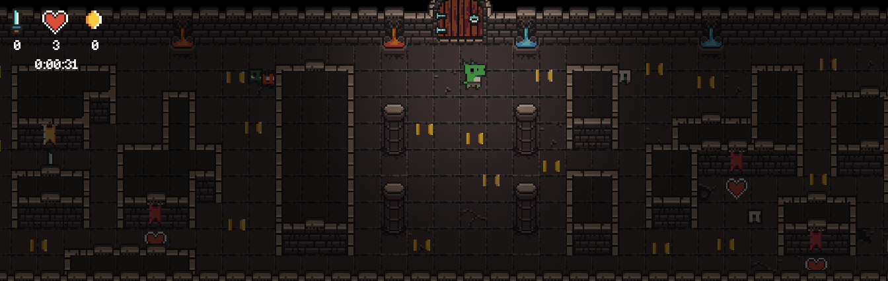

<h1>UM JOGO DE LABIRINTO</h1>

 

Você pode acessar o Jogo [aqui](https://escribo-game.web.app/).

## Sobre o jogo
No jogo você deverá percorrer o mapa até pegar todas as moedas. É possível finalizar o jogo de duas maneiras, ou morrendo ou coletando todas as moedas. O mapa está cheio de pequenos inimigos que te perseguem. Há três tipos de inimigos, mas a sua principal diferença está na velocidade de movimento e do campo de visão. O player irá perder uma "vida" para cada inimigo que tocar nele. Caso o player tenha coletado uma das duas espadas do mapa é possível anular o dano levado por um inimigo. Há corações espalhados no mapa para curar o player.

## Como testar o jogo
- Para testar o jogo utilize o navegador do seu computador.
- Use as teclas WASD ou as setas do seu teclado para controlar o player.
- O objetivo do jogo é coletar as moedas e sobreviver, para tanto o player deve evitar tocar nos inimigos.

## Packages usados
bonfire - 

just_audio - 

shared_preferences - 

## Observações
O desafio foi bem interessante e divertido, apesar de todas as dificuldades em lidar com a criação de mapas, colisões e de encontrar especificações mais precisas da documentação do bonFire. Muito código fonte, inclusive dos exemplos da documentação, foram analisados para auxiliar o teste.

O jogo foi disponibilizado na versão web através do firebase hosting por motivos de acessibilidade. Você pode acessar o Jogo [aqui](https://escribo-game.web.app/).
